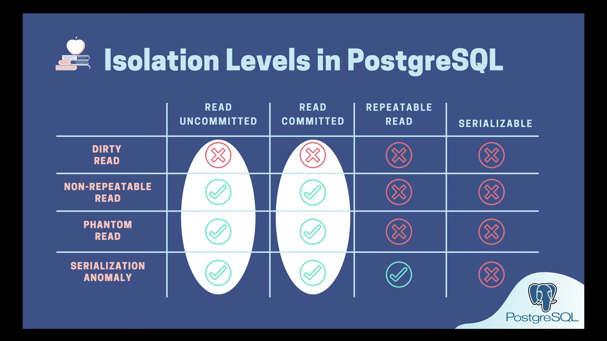

# Transaction Isolaltion Level and Read Phenomena in PostgreSQL

## Transaction Isolation Level

## Read Phenomena

- Dirty Read
  A transaction reads data written by other concurrent `uncommitted` transaction

- Non-Repeatable Read
  A transaction reads the same row twice and sees different value because it has been modified by other `committed` transaction

- Phantom Read
  A transaction re-executes a query to find rows that satisfy a condition and sees a different set of rows, due to changes by other `committed` transaction

- Serialization Anomaly
  The result of a group of concurrent `committed` transactions is impossible to achieve if we try to run them `sequentially` in any order without overlapping

## 4 Standard Isolation Levels

Low to High:

1. Read uncommitted: Can see data written by uncommited transaction
2. Read commited: Only see data written by commited transaction
3. Repeatable Read: Same read query always returns same result
4. Serializable: Can achieve same result if execute transactions serially in some order instead of concurrently

In Postgres, there are only 3 isolation levels and it uses dependencies detection techinque to avoid repeatable read. The default isolation level is `Read Committed`.
